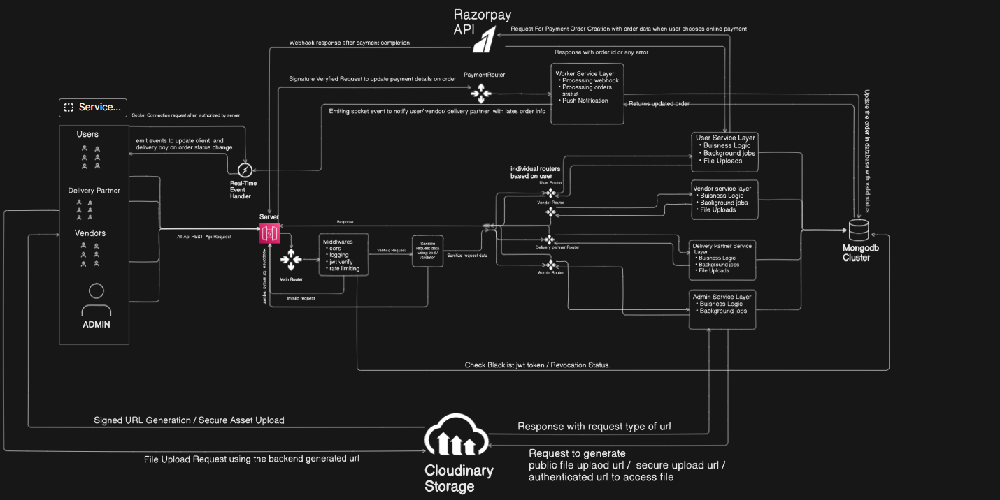

# 🍴 Grabit – E-Commerce Food Delivery Platform

**Grabit** is **Multi-Tenant MERN Platform** engineered to modernized the local food and subscription service market.
Inspired by the traditional **Mumbaicha Dabbewala** system, the platform features a three-sided marketplace with **Real Time Operational Intelligence** and flexible subscription management.

---

## 🚀 Application Flow

### 👤 User (Focus: Secure, Flexible Ordering)

- **Secure Identity Mangement :** Implemented robust JWT-protected user registration and login.
- **Optimezed Discovery :** Efficiently browse and filter product and **recurring subscription plans**.
- **Transactional Flow :** Manage the **Add-to-Cart** state (\*using **Zustand\***) and initiate high-priority **Instant Orders**
- **Checkout Pipline :** Complete the secure checkout flow, managing address validation and billing review prior to payment gateway integration.
- **Real-Time Order Status :** Track live order status via a dedicated dashboard and manage comprehensive history.

### 🏪 Vendor (Focus: Buisness Intelligence & Operations)

- **Onboarding & Compliance :** Submit creadentials and valid **Food License Documentation** for secure storage via **Cloudinary**
- **Role-based Activation :** Account activation initiated post-verification, granting access to the **Dashboard, Order Acceptance**
- **Operational Control :** Toggle restaurant availibility (open/close status) via a dedicated API endpoint, controlling order acceptance
- **Product Lifecycle Management (CRUD) :** Complete **CRUD Operations** for products and recurring meal subscriptions via secure endpoints.
- **Fulfillment Workflow :** Recieve and confirm validate orders, then update the order fulfillment status(e.g. 'Ready for Pickup') to trigger the Dilvery Partner notification.
- **Buisness Intelligence :** Access key performance indicators (KPIs) and sales analytics through the dedicated operational dashboard.

### 🚴 Delivery Partner(Focus: Logistic & Performance)

- **Onboarding & Verification :** Secure registration requiring license submission and account verification.
- **Role Eligibility :** Account verification enables eligibility for the delivery assignment algorithm.
- **Dynamic Assignment :** Recieve real-time order notification, auto-assigned via a **location-aware logic**
- **Last-Mile Logistics :** Executes the full delivery lifecycle (Accept,Pickup,Delivery) with API-driven real-time status updates.
- **Performance Tracking :** Monitor earnings, completed deliveries, and performance metrics via the dashboard.

---

## 📐 Architectural Strategy: Multi-Client, Monolith API

The platform uses a **Multi-Client Frontend** served by a **Single Monolithic Express API**. This choice was a deliberate, UX-driven engineering decision designed to optimize for diverse user needs and future scalability.

### 1. UX-Driven Frontend Segregation

We built four distinct frontends to provide an ideal experience for each user role:

| Module Set                  | Design Rationale                                                                                                                                                                               |
| :-------------------------- | :--------------------------------------------------------------------------------------------------------------------------------------------------------------------------------------------- |
| **User & Delivery Partner** | **Mobile-First Priority:** UIs are optimized for small screens to cater to on-the-go usage. This design choice simplifies the eventual transition to native mobile applications (Android/iOS). |
| **Vendor & Admin**          | **Desktop-Optimized:** UIs prioritize large-screen productivity, complex data reporting, and complex form interactions (e.g., subscription and product management).                            |

### 2. Backend Segregation & Security

A single Monolithic Express.js API handles all business logic, ensuring a consistent data model.

- **Custom Middleware:** All routes are protected by robust **JWT Validation** and **Custom Middleware** that checks the user's role/scope.
- **API Security:** This ensures complete API segregation, preventing any client (e.g., a User) from accessing unauthorized endpoints (e.g., `/api/vendor/orders`).

---

### System Architecture Diagram

This diagram illustrates the segregated flow of the three-sided application, highlighting real-time communication via the Socket Server and secure third-party integrations (Razorpay, Cloudinary).

---

## 🛠️ Tech Stack

- **Frontend**: React.js, Tailwind CSS, ShadCN UI, Zustand, Axios
- **Backend**: Express.js, JWT Authentication
- **Database**: MongoDB (Mongoose ODM)
- **Payments**: Razorpay Integration
- **Cloud Storage**: Cloudinary

---

## ✅ Completed Features

### **User Module**

- ✅ Landing Page + User Registration/Login
- ✅ Home Page with product/restaurant filtering
- ✅ Add to Cart + Instant Order flow
- ✅ Orders Review Page
- ✅ Profile Management (update personal details & address)
- ✅ Cart Component with quantity updates
- ✅ Checkout Page with billing/address review
- ⏳ Razorpay Payment Gateway (on hold)

---

### **Vendor Module**

- ✅ Vendor Registration/Login/Logout
- ✅ Sidebar with MobileNav
- ✅ Completed CRUD on product Module
- ✅ Dashboard UI completed
- ✅ Complted Profile setup.
  - Add/Update Profile details.
  - Add/Update Bank Details.
  - Add/Update Personal docs and secure access using **cloudinary**.
  - Manage Notifications and settings.

---

⚡ Grabit is being built as a **real-world scalable platform**, keeping vendor profitability and user flexibility in mind while delivering a seamless mobile-first experience.
